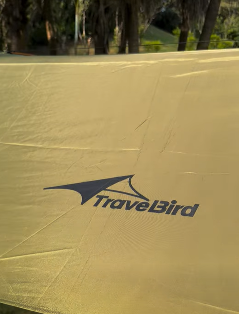

# Makuake プロジェクト掲載案

## 1. プロジェクトタイトル（40文字以内）

**ダブルポールで広がる空間。全天候型秘密基地感・2モード変形タープ**
*(文字数: 32文字)*

## 2. キービジュアル

## 3. プロジェクト概要（3行以内）

1. 改良型ダブルポールが生み出す「圧倒的広さ」と「設営のしやすさ」。全天候対応サイドウォール搭載。
2. 地上モード＆空中モードの2way仕様。ハンモックとも相性抜群のサンシェードに変形可能。
3. 遮光・防水PU2000+のタフなスペック。わずか3分で設営完了、家族の時間をもっと快適に。

---

## 4. 本文（ストーリー）

### はじめに（課題と解決）

キャンプ場に着いてからの設営、汗だくになっていませんか？
急な雨や、強烈な日差しに悩まされていませんか？

「もっと手軽に、もっと快適に、自然を楽しみたい。」
そんなキャンパーの声に応えるために生まれたのが、この**Double-Pole Waterproof Tarp**です。

*(動画: makuake　タープ写真/二重ポール防水キャノピーのビデオ (1).mp4)*

### プロダクトの特徴（5つの革命的ポイント）

#### Point 1: 空間を最大化する「改良型ダブルポール」

従来のタープとは異なり、2本のアルミ合金製サポートポールが天井部の空間を大きく広げます。
頭上の圧迫感をなくし、居住空間を最大限に活用できる設計です。

#### Point 2: 変幻自在の「サイドウォール」システム

天候に合わせて形状を変えられるサイドウォールを装備。

- **雨・風のとき**: カーテンを下げて、シェルターのように雨風を完全ブロック。
- **晴れのとき**: カーテンを上げて、圧倒的な通気性と見晴らしを確保。
蒸れを軽減し、常に快適な環境を作り出します。

#### Point 3: 「地上」と「空中」、選べる2つのモード

1つのタープで、全く異なる2つのキャンプスタイルを楽しめます。

**【地上モード】秘密基地のようなプライベート空間**
地面に設営し、一時的なシェルターとして。周囲の視線を遮り、落ち着いた空間を作ります。

**【空中モード】ハンモックと合わせたワイルドスタイル**
付属のロープで木に吊るせば、ハンモックと相性抜群のサンシェードに。ジャングルアドベンチャーのようなワイルドなスタイルにも対応。

*(動画: makuake　タープ写真/二重ポール防水キャノピーのビデオ (2).mp4)*

#### Point 4: 驚くほどスムーズな「簡単セットアップ」

「付属品が多すぎて設営が大変…」そんな常識を覆し**Q: 初心者でも設営できますか？**
A: はい、付属品がプリインストールされており、初めての方でもスムーズに設営可能です。適切な場所を見つけたら、広げて固定するだけ。
初めての方でも直感的に設営が可能です。

*(動画: makuake　タープ写真/二重ポール防水キャノピーのビデオ (3).mp4)*

#### Point 5: 圧倒的な広さと収納性

展開サイズは **435 × 285 cm**。家族全員が入れる十分な広さを確保しながら、
収納時は **33 × 10 × 10 cm** と驚くほどコンパクトに。
バックパックの隙間にすっぽり収まるサイズ感です。

### 利用シーン

- **ジャングルアドベンチャー / ソロキャンプ**: ハンモックと組み合わせて、地面の状況を選ばない空中泊。
- **ファミリーキャンプ**: サイドウォールを上げて、開放的なリビングとして。
- **釣り・ピクニック**: 日差しを遮り、急な雨もしのげる休憩拠点として。

### 仕様（スペック）

| 項目 | 内容 |
| --- | --- |
| 製品名 | Double-Pole Waterproof Tarp（ダブルポール防水タープ） |
| サイズ（展開時） | 435 × 285 cm (14.5 × 9.5 ft) |
| サイズ（収納時） | 33 × 10 × 10 cm (13 × 4 × 4 inch) |
| 重量 | 約 1.23 kg (2.72 lbs) |
| 素材 | 210T ポリエステル |
| コーティング | PU2000 防水コーティング + シルバーサンシェードコーティング |
| 付属品 | アルミ合金製サポートポール×2、グランドペグ×6、防風ロープ×6、伸縮ロープ×2、収納バッグ |

### 実行者紹介

**Select Bargain Store**
私たちは、世界中の優れたアウトドア用品を日本の皆様にお届けするセレクトショップです。
今回のタープは、製造元であるTravelbird Technology社との独占契約により、日本での先行販売が実現しました。
*(動画: makuake　タープ写真/二重ポール防水キャノピーのビデオ (4).mp4)*

---

## 5. リターン（応援購入）設定案

※一般販売予定価格を **[Y,YYY円]** と仮定した場合の割引率設定です。

### 【超早割 35%OFF】Double-Pole Waterproof Tarp × 1

**[X,XXX円]**（税込・送料込）
限定 50名様

- Double-Pole Waterproof Tarp 一式
- 一般販売予定価格 [Y,YYY円] から 35%OFF

### 【早割 25%OFF】Double-Pole Waterproof Tarp × 1

**[X,XXX円]**（税込・送料込）
限定 100名様

- Double-Pole Waterproof Tarp 一式
- 一般販売予定価格 [Y,YYY円] から 25%OFF

### 【Makuake割 15%OFF】Double-Pole Waterproof Tarp × 1

**[X,XXX円]**（税込・送料込）

- Double-Pole Waterproof Tarp 一式
- 一般販売予定価格 [Y,YYY円] から 15%OFF

### 【セット割 35%OFF】Double-Pole Waterproof Tarp × 2（ペアセット）

**[XX,XXX円]**（税込・送料込）
限定 30名様

- Double-Pole Waterproof Tarp 一式 × 2
- 一般販売予定価格 [2Y,YYY円] から 35%OFF

---

## 6. リスク＆チャレンジ（必須項目）

- プロジェクトに関する情報
  - プロジェクトの属性：輸入商品
  - 代理店によるサポート：初期不良の交換対応（お届けから○ヶ月）、日本語カスタマーサポート
  - 実行者（国）：日本
  - 企画国：日本
  - 製造国：中国

※並行輸入品が発生する可能性があります。正規代理店による並行輸入の防止措置は行いますが、個人輸入及び販路によっては完全に防ぐことができない可能性がある点、ご了承願います。
※使用感などに関しては、感じ方に個人差が予想される製品でございます。そのため、サイズ・使用感等に関する返品・返金はお受けいたしかねます。
※初期不良以外に関する返品・返金はお受けいたしかねます。
※デザイン・カラー・素材などの仕様が一部変更になる可能性があります。
※モニター環境によって、画像の色が実物と異なって見える場合がございます。
※昨今の世界情勢や、資材の供給不足などにより、製造・配送に遅れが生じる可能性がございます。
※ご支援の数が想定を上回った場合、製造工程上の都合等により出荷時期が遅れる場合がございます。
※本文中に記載させていただいたスケジュールは、あくまでプロジェクト公開時点の予定です。応援購入の性質上、配送遅延のおそれがございます。原則として、配送遅延に伴う応援購入のキャンセルはできませんが、リターン配送予定月から6ヶ月を超えた場合には、希望者に限りキャンセルにて対応させていただきます。

以上の注意点につきましてあらかじめご理解とご了承いただいた上でご支援くださいますよう、よろしくお願い申し上げます。
